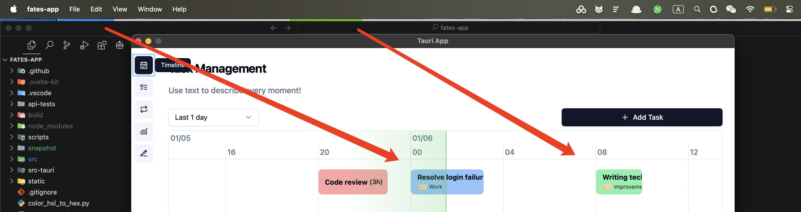
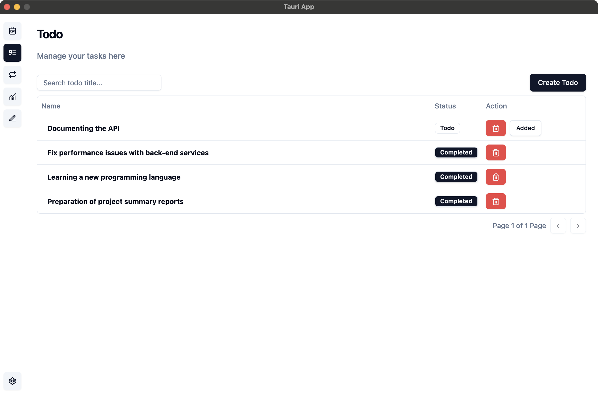
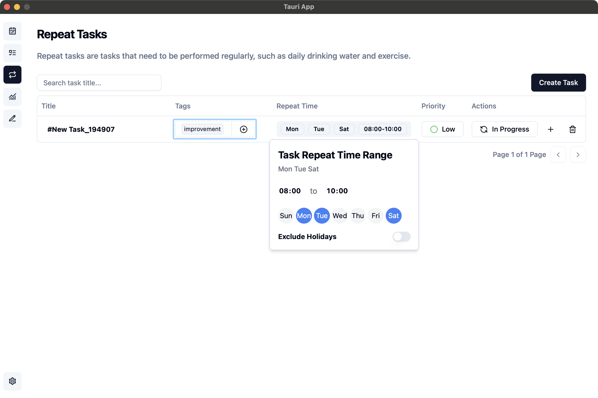
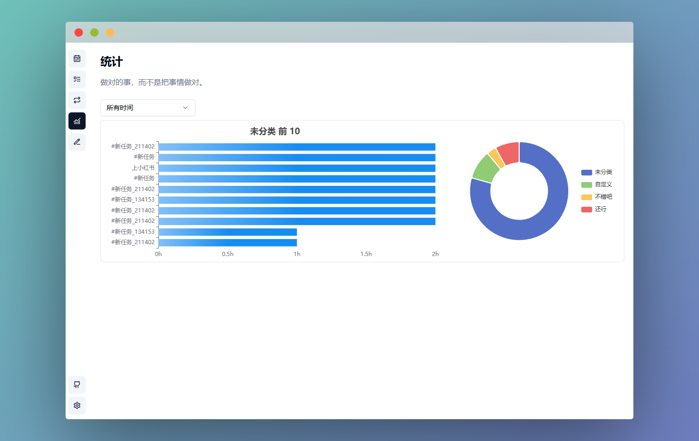
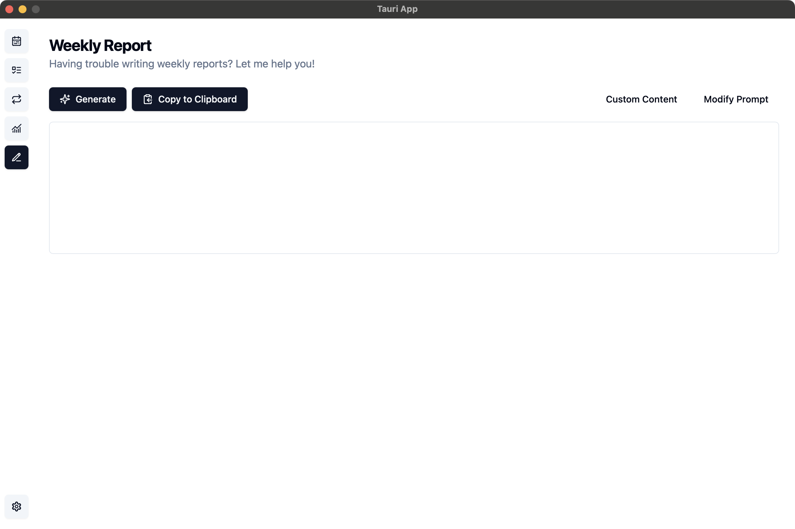

# Fates App

<div align="center">
</p>
<a href="https://opensource.org/licenses/MIT">
  
</a>
<a href="https://tauri.app/">
  
</a>
<a href="https://svelte.dev/">
  
</a>

一个现代化的个人时间管理和任务追踪应用程序

<a href="./README_EN.md">English</a> | 简体中文

</div>

## 特性

-   任务管理：直观的待办事项管理，支持优先级设置和状态追踪，以及每日热力图
-   日程追踪：可视化的每日时间进度条
-   支持事项：支持添加待办事项、重复任务
-   数据统计：根据选择的时间范围，对事项记录进行统计分析
-   周报助手：根据最近一周的事项记录，生成周报

## 应用截图

### 任务管理

<details>
<summary>任务管理</summary>


</details>

### 日程追踪

<details>
<summary>日程追踪</summary>



</details>

### 待办事项



### 重复任务



### 数据统计

<details>
<summary>数据统计</summary>



</details>

### 周报助手

<details>
<summary>周报助手</summary>



</details>

## 🚀 快速开始

### 安装

1. 从 [Releases](https://github.com/Mainstayz/fates-app/releases) 页面下载最新版本
2. 运行安装程序
3. 按照安装向导的指示完成安装

### 开发环境设置

```bash
# 克隆仓库
git clone https://github.com/Mainstayz/fates-app.git

# 进入项目目录
cd fates-app

# 安装依赖
pnpm install

# 启动开发服务器
pnpm tauri dev
```

## 🤝 贡献指南

我们欢迎所有形式的贡献，无论是新功能、bug 修复还是文档改进。请遵循以下步骤：

1. Fork 本仓库
2. 创建您的特性分支 (`git checkout -b feature/AmazingFeature`)
3. 提交您的更改 (`git commit -m 'Add some AmazingFeature'`)
4. 推送到分支 (`git push origin feature/AmazingFeature`)
5. 开启一个 Pull Request

## 📄 许可证

本项目基于 Apache 2.0 许可证开源 - 查看 <LICENSE> 文件了解更多详情

## 🙏 致谢

-   [Tauri](https://tauri.app/)
-   [Svelte](https://svelte.dev/)
-   [Tailwind CSS](https://tailwindcss.com/)
