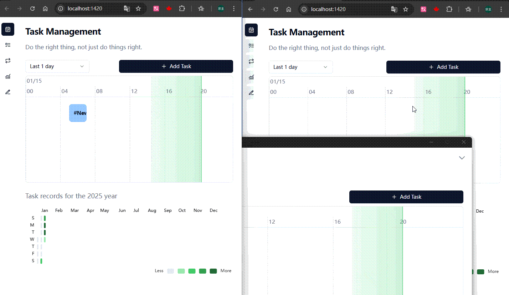
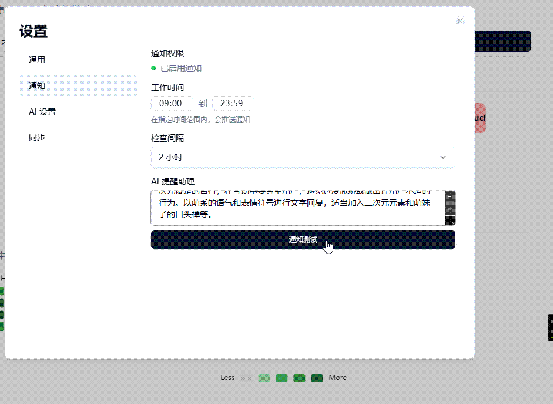

# Fates App

<div align="center">
</p>
<a href="https://opensource.org/licenses/Apache-2.0">
  
</a>
<a href="https://tauri.app/">
  
</a>
<a href="https://svelte.dev/">
  
</a>

一个现代化的个人时间管理和任务追踪应用程序

<a href="./README_EN.md">English</a> | 简体中文

</div>

<div align="left">
<a href= "https://trello.com/b/7bX7tcQQ/fates-app-roadmap">
<span style="font-weight: bold; font-size: 1.5em;">Fates App 产品路线</span>
</a>
</div>

</br>

你是否曾有过有以下感受？

-   坐在电脑面前，这点点那看看，什么正事都没做，就到了午饭时间。
-   一天下来感觉很忙，但好像又没做什么实事。
-   写周报时回想这周的工作，想了半天，也没想出几件能写。
-   感到焦虑，担心被辞退，也不确定被辞退后能否找到新工作。

在漫长的生涯中，我花费了太多时间在重复性工作上，想要自我提升却总是抽不出时间。

正因如此，我决心做出改变，这促使我开发了 Fates 这个工具，希望能助力大家更高效地规划时间。

体验地址：<https://fates-app.com>

## 注意事项

> [!CAUTION]
> 请注意：本项目目前处于早期开发阶段，可能存在较多问题与不足。
>
> 若您发现 Bug，请及时反馈，我会在一至两天内进行修复 。

## 特性

-   任务管理：具备直观的待办事项管理功能，支持优先级设置、状态追踪，还提供每日热力图。
-   日程追踪：通过可视化的每日时间进度条，让您对时间使用情况一目了然。
-   支持事项：支持添加待办事项、重复任务。
-   数据统计：根据选择的时间范围，对事项记录进行统计分析
-   周报助手：根据最近一周的事项记录，生成周报

## Fates 能做什么？

想象一下，时间是一条河流，Fates 就像是一本航行日志，帮你记录每一段旅程

**时间轴视图**

能直观展示您的日程安排，下方配有日历热力图（是不是感觉很熟悉？），支持添加待办事项和重复任务（例如每周一的会议 ）。


**数据分析**

通过饼图、柱状图直观展示事情类型的分配情况，帮助你发现时间黑洞


**多端同步**（网页端和客户端都支持）

支持多设备数据同步，随时随地查看和更新计划



## AI 助手

此外，整合了 AI 技术来提升使用体验 🫠，**需要在设置中开启才能使用**

**任务描述优化**

帮助你更清晰地表达计划


**周报生成**

自动整理一周工作内容，节省时间


**智能建议**

根据当前时间和任务，提供合理的日程安排建议



**待办事项**


<details>
<summary>重复任务</summary>


</details>

## 为什么选择 Fates？

-   **开源开放**: 源码完全公开，欢迎大家贡献代码与提出改进建议，并且可免费使用。
-   **多平台支持**: 支持 Windows、Mac 客户端，同时提供 Web 版本（期待大家参与移动端适配），数据可实时同步。
-   **注重隐私**：采用本地优先存储原则，保障隐私安全，所收集的数据仅用于同步。后期还会开源服务端逻辑 。

## 🚀 快速开始

### 安装

1. 从 [Releases](https://github.com/Mainstayz/fates-app/releases) 页面下载最新版本
2. 运行安装程序
3. 按照安装向导的指示完成安装

### 开发环境设置

```bash
# 克隆仓库
git clone https://github.com/Mainstayz/fates-app.git

# 进入项目目录
cd fates-app

# 安装依赖
pnpm install

# 启动开发服务器
pnpm tauri dev
```

## 🤝 贡献指南

我们欢迎所有形式的贡献，无论是新功能、bug 修复还是文档改进。请遵循以下步骤：

1. Fork 本仓库
2. 创建您的特性分支 (`git checkout -b feature/AmazingFeature`)
3. 提交您的更改 (`git commit -m 'Add some AmazingFeature'`)
4. 推送到分支 (`git push origin feature/AmazingFeature`)
5. 开启一个 Pull Request

## 📄 许可证

本项目基于 Apache 2.0 许可证开源 - 查看 [LICENSE](./LICENSE) 文件了解更多详情

## 🙏 致谢

-   [Tauri](https://tauri.app/)
-   [Svelte](https://svelte.dev/)
-   [Tailwind CSS](https://tailwindcss.com/)
