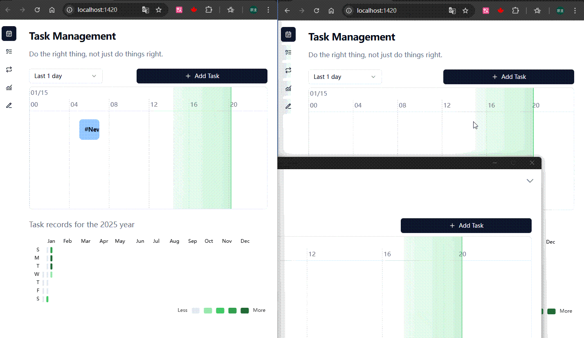
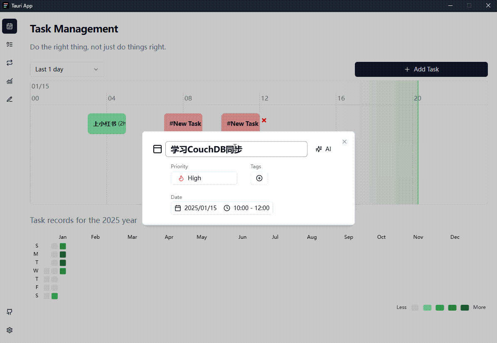
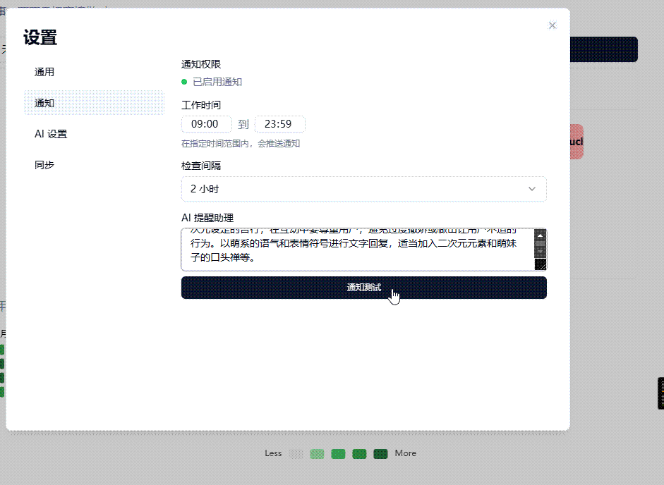

# Fates App

<div align="center">
</p>
<a href="https://opensource.org/licenses/Apache-2.0">
  
</a>
<a href="https://tauri.app/">
  
</a>
<a href="https://svelte.dev/">
  
</a>

A modern personal time management and task tracking application

<a href="./README_EN.md">English</a> | 简体中文

</div>

<div align="left">
<a href= "https://trello.com/b/7bX7tcQQ/fates-app-roadmap">
<span style="font-weight: bold; font-size: 1.5em;">Fates App Roadmap</span>
</a>
</div>

</br>

Have you ever felt like:

-   Sitting in front of your computer, clicking around, doing nothing productive, and suddenly it's lunch time.
-   Feeling busy all day but not accomplishing much.
-   Struggling to recall what you did this week when writing your weekly report.
-   Feeling anxious about job security and uncertain about finding new opportunities.

In my long career, I've spent too much time on repetitive work, wanting to improve myself but never finding the time.

This realization drove me to make a change, leading to the development of Fates, a tool to help everyone plan their time more efficiently.

Try it now: <https://fates-app.com>

## Notice

> [!CAUTION]
> Please note: This project is in early development and may have many issues and shortcomings.
>
> If you find any bugs, please report them and I will fix them within 1-2 days.

## Features

-   Task Management: Intuitive to-do list management with priority setting, status tracking, and daily heatmap.
-   Schedule Tracking: Visual daily time progress bar for clear time usage overview.
-   Task Support: Add to-do items and recurring tasks.
-   Data Statistics: Analyze task records based on selected time ranges.
-   Weekly Report Assistant: Generate weekly reports based on recent task records.

## What can Fates do?

Imagine time as a river, Fates is like a logbook, helping you record every journey.

**Timeline View**

Visually displays your schedule with a calendar heatmap below (look familiar?). Supports adding to-do items and recurring tasks (like weekly meetings).


**Data Analysis**

Uses pie charts and bar charts to visually show task type distribution, helping you identify time sinks.


**Multi-device Sync** (Supports web and desktop)

Sync data across devices to view and update plans anytime, anywhere.



## AI Assistant

Additionally, integrates AI technology to enhance user experience 🫠, **requires enabling in settings**

**Task Description Optimization**

Helps you express plans more clearly.



**Weekly Report Generation**

Automatically organizes weekly work content, saving time.


**Smart Suggestions**

Provides reasonable schedule suggestions based on current time and tasks.



**To-do List**


<details>
<summary>Recurring Tasks</summary>


</details>

## Why Choose Fates?

-   **Open Source**: Fully open source, welcomes code contributions and suggestions, and is free to use.
-   **Multi-platform Support**: Supports Windows, Mac clients, and web version (looking forward to mobile adaptation), with real-time data sync.
-   **Privacy Focused**: Local-first storage principle ensures privacy security. Collected data is only used for sync. Server logic will be open sourced later.

## 🚀 Quick Start

### Installation

1. Download the latest version from [Releases](https://github.com/Mainstayz/fates-app/releases)
2. Run the installer
3. Follow the installation wizard instructions

### Development Environment Setup

```bash
# Clone repository
git clone https://github.com/Mainstayz/fates-app.git

# Enter project directory
cd fates-app

# Install dependencies
pnpm install

# Start development server
pnpm tauri dev
```

## 🤝 Contributing

We welcome all forms of contributions, whether new features, bug fixes, or documentation improvements. Please follow these steps:

1. Fork the repository
2. Create your feature branch (`git checkout -b feature/AmazingFeature`)
3. Commit your changes (`git commit -m 'Add some AmazingFeature'`)
4. Push to the branch (`git push origin feature/AmazingFeature`)
5. Open a Pull Request

## 📄 License

This project is open source under the Apache 2.0 license - see [LICENSE](./LICENSE) file for details

## 🙏 Acknowledgments

-   [Tauri](https://tauri.app/)
-   [Svelte](https://svelte.dev/)
-   [Tailwind CSS](https://tailwindcss.com/)
