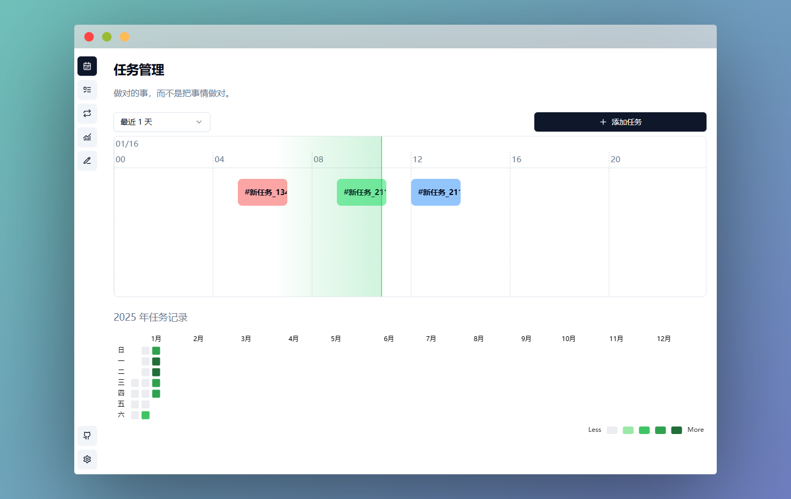
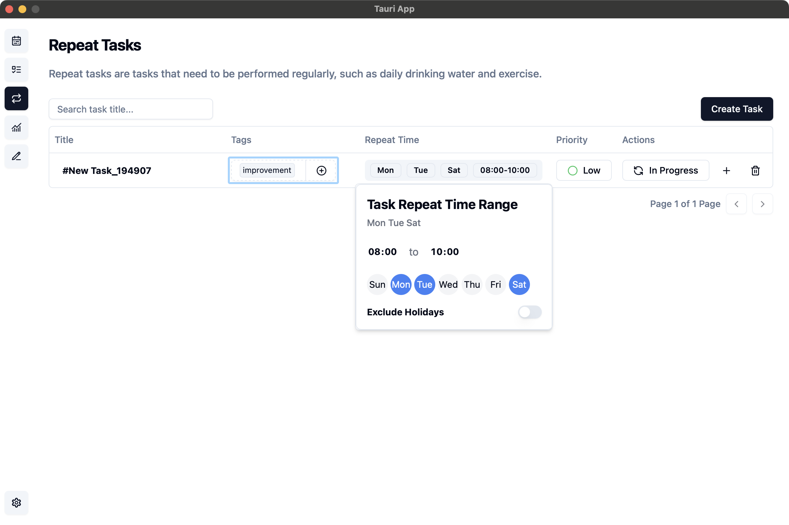
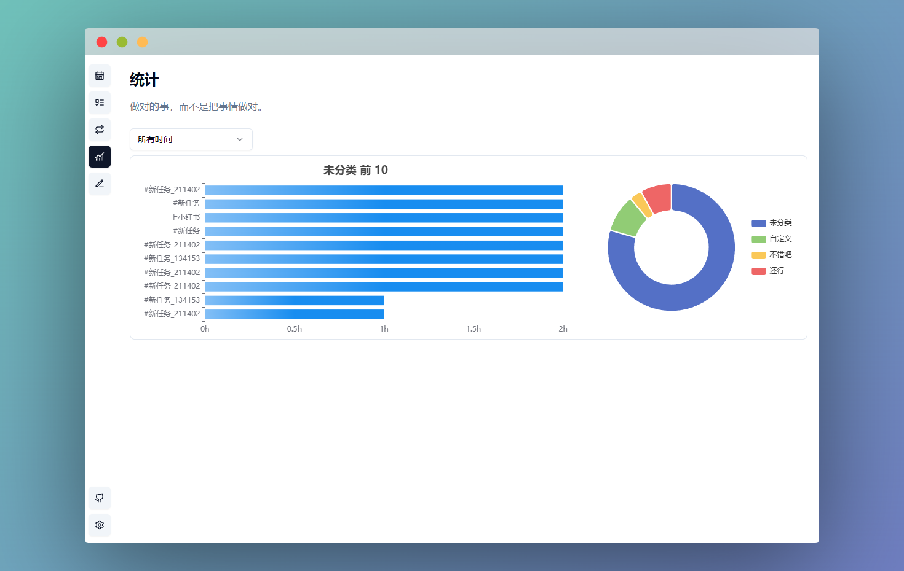
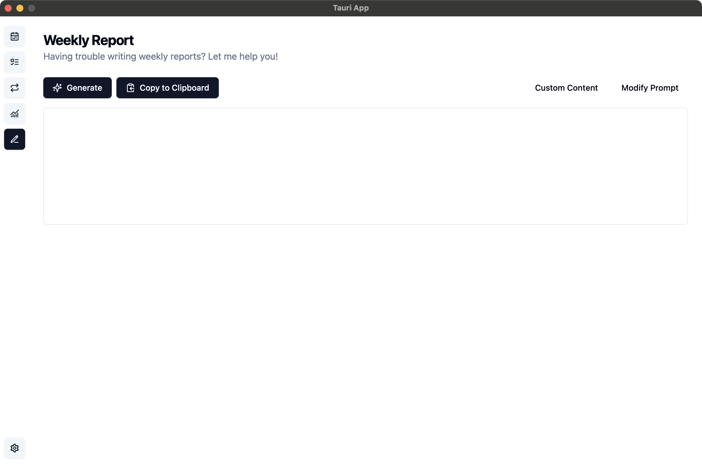

# Fates App

<div align="center">
</p>
<a href="https://opensource.org/licenses/Apache-2.0">
  
</a>
<a href="https://tauri.app/">
  
</a>
<a href="https://svelte.dev/">
  
</a>

A modern personal time management and task tracking application

English | <a href="./README.md">简体中文</a>

</div>

## Features

-   Task Management: Intuitive todo management with priority setting, status tracking, and daily heatmap
-   Schedule Tracking: Visual daily time progress bar
-   Todo Support: Add todos and recurring tasks
-   Data Statistics: Analyze task records based on selected time range
-   Weekly Report Assistant: Generate weekly reports based on recent task records

## Application Screenshots

<details open>
<summary>Task Management</summary>



</details>

<details>
<summary>Schedule Tracking</summary>


</details>

<details>
<summary>Todo List</summary>


</details>

<details>
<summary>Recurring Tasks</summary>



</details>

<details>
<summary>Data Statistics</summary>



</details>

<details>
<summary>Weekly Report Assistant</summary>



</details>

## 🚀 Getting Started

### Installation

1. Download the latest version from [Releases](https://github.com/Mainstayz/fates-app/releases)
2. Run the installer
3. Follow the installation wizard to complete setup

### Development Environment Setup

```bash
# Clone repository
git clone https://github.com/Mainstayz/fates-app.git

# Enter project directory
cd fates-app

# Install dependencies
pnpm install

# Start development server
pnpm tauri dev
```

## 🤝 Contribution Guide

We welcome all forms of contributions, whether new features, bug fixes, or documentation improvements. Please follow these steps:

1. Fork this repository
2. Create your feature branch (`git checkout -b feature/AmazingFeature`)
3. Commit your changes (`git commit -m 'Add some AmazingFeature'`)
4. Push to the branch (`git push origin feature/AmazingFeature`)
5. Open a Pull Request

## 📄 License

This project is open source under the Apache 2.0 license - see <LICENSE> file for details

## 🙏 Acknowledgments

-   [Tauri](https://tauri.app/)
-   [Svelte](https://svelte.dev/)
-   [Tailwind CSS](https://tailwindcss.com/)
