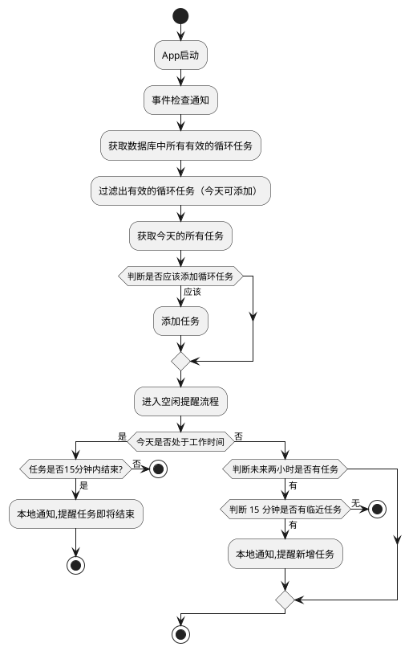

[Timeline view](https://dribbble.com/shots/21999145-Timeline-view)
[Timeline View Task Management Dashboard](https://dribbble.com/shots/23919900-Timeline-View-Task-Management-Dashboard)
[Gamma Task Management](https://dribbble.com/shots/24467419-Gamma-Task-Management)
[Klaboard Task Management Dashboard Timeline View](https://dribbble.com/shots/24892900-Klaboard-Task-Management-Dashboard-Timeline-View)
[Projects Gantt View](https://dribbble.com/shots/21099259-Projects-Gantt-View)
[SaaS Gantt Timeline View](https://dribbble.com/shots/24713025-SaaS-Gantt-Timeline-View)
[Project Management Dashboard Project Timeline](https://dribbble.com/shots/17482889-Project-Management-Dashboard-Project-Timeline)
[Dashboard Project Timeline](https://dribbble.com/shots/22170343-Dashboard-Project-Timeline)
[Tasky Task Management Dashboard](https://dribbble.com/shots/19904851-Tasky-Task-Management-Dashboard)
[Timeline Project Management Interface](https://dribbble.com/shots/18249324-Timeline-Project-Management-Interface)
[TimUp Timeline Calendar Dashboard](https://dribbble.com/shots/18594250-TimUp-Timeline-Calendar-Dashboard)

颜色搭配：

https://tinte.railly.dev/shadcn

https://uicolorful.com/template/saas

使用 Export：

https://uicolors.app/create

Tauri 2.0 Updater 自动更新指南[https://juejin.cn/post/7358446362575568906]

数据库设计：

```json
{
    "matter": {
        "id": "uuid,primary_key",
        "title": "string,not_null",
        "description": "string,nullable,default:'',",
        "tags": "string,nullable,default:'',",
        "start_time": "timestamp,not_null",
        "end_time": "timestamp,not_null",
        "priority": "number,default:0",
        "type": "number,default:0",
        "created_at": "timestamp,not_null",
        "updated_at": "timestamp,not_null",
        "reserved_1": "string,nullable,default:'',",
        "reserved_2": "string,nullable,default:'',",
        "reserved_3": "string,nullable,default:'',",
        "reserved_4": "string,nullable,default:'',",
        "reserved_5": "string,nullable,default:'',"
    },
    "kvstore": {
        "key": "string,not_null",
        "value": "string,default:'',",
        "created_at": "timestamp,not_null",
        "updated_at": "timestamp,not_null"
    },
    "tags": {
        "name": "string,not_null",
        "created_at": "timestamp,not_null"
    }
}
```


